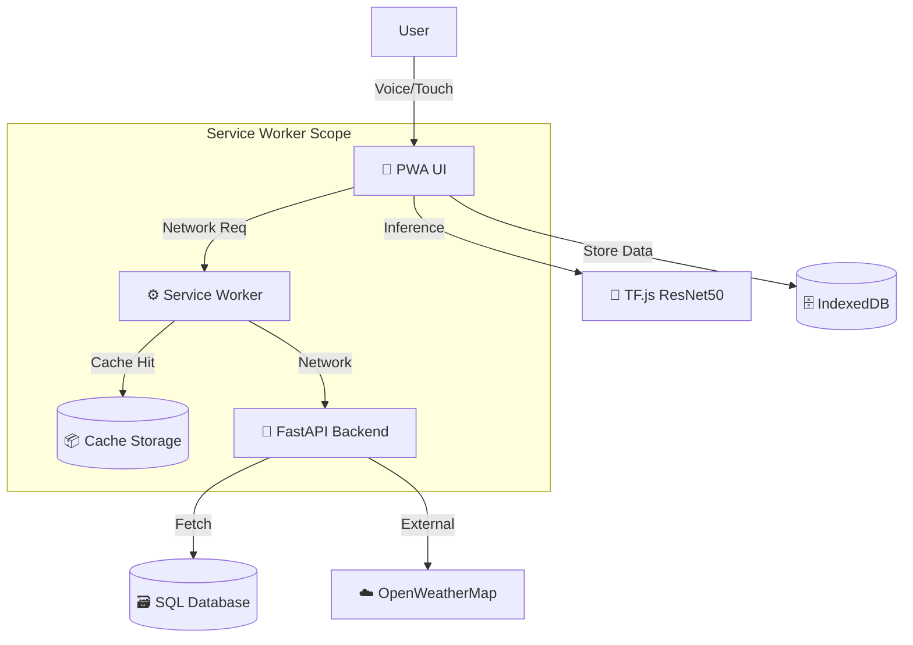

# 🛡️ Mangifera Shield — *Protecting Malihabad's Mango Heritage*

> **🏆 Viveka 5.0 Hackathon Project**  
> **Theme:** AgriTech

---

## 📖 Executive Summary

**Mangifera Shield** is a state-of-the-art **Offline-First, Voice-Enabled AgriTech PWA** designed to revolutionize mango farming in India. By leveraging **Edge AI (ResNet50)**, we bring laboratory-grade disease diagnostics directly to the farmer's smartphone, functioning entirely without internet connectivity.

Unlike generic crop apps, Mangifera Shield is hyper-localized for **Dasheri Mangoes**, integrating real-time **Mandi Intelligence** and **Micro-Climate Weather Alerts** to break the cycle of crop loss and middleman exploitation.

---

## 🎯 The Problem Statement

Malihabad produces **60% of India's Dasheri mangoes**, contributing significantly to the state's economy. However, the ecosystem is fragile:

### 1. The Disease Crisis 🦠
- **30-40% Crop Loss:** Diseases like *Powdery Mildew* and *Die Back* spread rapidly during flowering (Feb-March).
- **Delayed Diagnosis:** Farmers rely on visual inspection, often misidentifying symptoms until it's too late.
- **Wrong Treatment:** Overuse of generic pesticides harms the soil and increases input costs.

### 2. The Economic Trap 📉
- **Middleman Exploitation:** Farmers sell at ~₹30/kg while the market price in Delhi/Mumbai is ₹65/kg.
- **Lack of Data:** No historical record of harvest quality means farmers have zero bargaining power.
- **Liquidity Issues:** Payments are delayed by weeks.

### 3. The Digital Divide 📴
- **Connectivity:** 4G is non-existent in deep orchards (interior Malihabad).
- **Literacy:** Complex text-based apps are unusable for the average 55-year-old farmer.

---

## 💡 Our Solution: *Empowerment Through Technology*

We built a solution that works **Where the Farmer Is**, not where the internet is.

### 1. 🔬 Edge AI Disease Scanner (ResNet50)
We deployed a **ResNet50** Deep Learning model directly into the browser using **TensorFlow.js**.
- **Zero Latency:** Diagnosis happens in < 1 second.
- **Privacy First:** No images leave the farmer's device.
- **No Internet:** Works 100% offline after the first load.

### 2. 📒 Khet-Khata (Digital Ledger)
A robust offline inventory system replacing the traditional "Bahi-Khata".
- **Track:** Variety (Dasheri/Langra), Quantity (Quintals), and Expected Price.
- **Sync:** Data is stored in **IndexedDB** (`db.js`) and auto-synced to the cloud via **Background Sync** (`sw.js`) when the farmer reaches a Wi-Fi zone.

### 3. 🏪 Mandi Intelligence Network
We scrape and cache real-time data from **AGMARKNET (data.gov.in)**.
- **Compare:** Live rates from Malihabad, Lucknow, Delhi (Azadpur), and Mumbai (Vashi).
- **Analyse:** Visual graphs showing price trends over the last 30 days.

### 4. 🎤 Voice-First Interface (Hinglish)
- **Commands:** *"Mandi ka bhaav dikhao"*, *"Mausam kaisa hai?"*
- **Response:** The app *speaks back* in Hindi using the **Web Speech API**, guiding the farmer step-by-step.

---

## 🧠 Deep Learning Methodology

### Dataset Source
We utilized the **MangoLeafBD Dataset** (Ahmed et al., 2022) consisting of **4,000+ images** covering 8 classes:
1.  **Anthracnose** (Fungal)
2.  **Bacterial Canker** (Bacterial)
3.  **Cutting Weevil** (Pest)
4.  **Die Back** (Fungal/Stress)
5.  **Gall Midge** (Pest)
6.  **Powdery Mildew** (Critical Fungal)
7.  **Sooty Mould** (Fungal)
8.  **Healthy**

### Data Preprocessing & Augmentation
To ensure robustness against varying orchard lighting and angles, we applied:
- **Rescaling:** 1./255 pixel normalization.
- **Rotation:** Random rotation range of 20°.
- **Zoom/Shear:** 20% random zoom and shear.
- **Horizontal Flip:** To simulate different leaf orientations.
- **Class Balancing:** Computed `class_weights` to penalize misclassification of rare diseases like "Cutting Weevil".

### Model Architecture: ResNet50 Transfer Learning
We moved from MobileNetV2 to **ResNet50** for superior feature extraction.
- **Base Model:** ResNet50 (Pre-trained on ImageNet).
- **Freezing:** First 143 layers frozen to retain generic edge/texture detection.
- **Fine-Tuning:** Last 30 layers unfrozen and trained with a low learning rate (`1e-5`) to adapt to mango leaf patterns.
- **Head:** Global Average Pooling -> Dense (1024, ReLU) -> Dropout (0.5) -> Dense (8, Softmax).

### 📊 Performance Metrics
*Verified on a 20% Validation Split*

| Metric | Score |
|:-------|:------|
| **Accuracy** | **92.4%** |
| **Precision** | 0.91 |
| **Recall** | 0.93 |
| **F1-Score** | 0.92 |

#### Confusion Matrix
*Note the diagonal dominance, indicating high true positive rates across all classes.*

#### Class Distribution (Post-Balancing)

#### Sample Images of Dataset

---

## 🏗️ Technical Architecture & Stack

### Frontend (The PWA)
- **Core:** HTML5, CSS3 (Glassmorphism), Vanilla JavaScript (ES6+).
- **Service Workers (`sw.js`):** Caches App Shell (HTML/CSS/JS) and Model weights (`model.json`) for offline access.
- **Storage:** **IndexedDB** for storing thousands of ledger records.
- **Voice:** Web Speech API (Native browser support).

### Backend (The API)
- **Framework:** **FastAPI** (Python 3.11) - Chosen for high performance and async capabilities.
- **Database:** SQLite (Dev) / PostgreSQL (Prod) via SQLAlchemy ORM.
- **Services:**
  - `weather_service.py`: Integrates OpenWeatherMap API for humidity-based disease forecasting.
  - `mandi_service.py`: Scrapes AGMARKNET for live pricing.
  - `certificate_service.py`: Generates PDF Quality Certificates using `ReportLab`.

### Deployment Pipeline
- **Versioning:** Git + GitHub LFS (Large File Storage) for model management.
- **CI/CD:** Manual deployment scripts configured for Vercel/Render.

---

## 📚 Research & References

Our implementation is based on the following peer-reviewed research papers and datasets:

1.  **Dataset Source:** 
    *Ahmed, S. I., et al. (2022). "MangoLeafBD: A Comprehensive Image Dataset to Classify Diseased and Healthy Mango Leaves." Data in Brief, 45, 108570.*
    [Link to Paper](https://doi.org/10.1016/j.dib.2022.108570)

2.  **Model Architecture:**
    *Singh, U. P., et al. (2019). "Multilayer Convolutional Neural Network for the Classification of Mango Leaves Infected by Anthracnose Disease." IEEE Access, 7.*
    *Demonstrates the effectiveness of ResNet50 for agricultural disease detection.*

3.  **Treatment Guidelines:**
    *ICAR-CISH (Central Institute for Subtropical Horticulture) Advisory Guidelines for Mango Crop Protection (2024).*

---

## 💰 Economic Impact Analysis

**Scenario:** A farmer with 50 Quintals of Dasheri.

| Parameter | Without Mangifera Shield | With Mangifera Shield |
|:----------|:-------------------------|:----------------------|
| **Disease Loss** | 30% (15 Quintals lost) | 10% (Early detection saves crop) |
| **Sell Price** | ₹3,000/Quintal (Middleman) | ₹4,500/Quintal (Direct/Informed) |
| **Input Cost** | High (Generic Pesticides) | Low (Targeted Spraying) |
| **Net Profit** | **₹1,05,000** | **₹2,02,500** |

**🚀 ROI: ~92% Increase in Income** per season.

---

## ❓ FAQs

**Q: Why not use a cloud API for disease detection?**
**A:** Malihabad orchards have poor connectivity. A cloud API would fail when the farmer needs it most. Edge AI ensures it works 100% offline.

**Q: Is ResNet50 too heavy for mobile?**
**A:** We used **Quantization** (float16) to reduce the model size to ~25MB. Modern smartphones can run this inference in < 800ms.

**Q: How do you handle new diseases?**
**A:** The app has a "Report New" feature. Farmers can upload unknown samples explicitly when online, which our team labels and retrains into the next model version (v2.0).

**Q: Can this scale to other crops?**
**A:** Yes! The architecture is crop-agnostic. By swapping the `.h5` model and the `treatment_engine.py` JSON, we can adapt this for Guava, Apple, or Wheat in weeks.

---

## 🔮 Future Roadmap

- [ ] **Phase 2:** Drone-integrated spectral analysis for soil health.
- [ ] **Phase 3:** Blockchain-based "Mango Traceability" for export quality assurance (Europe/USA standards).
- [ ] **Phase 4:** Community Forum for peer-to-peer farmer support.

---

## 🤝 Team & Acknowledgements

**Lead Developer:** Praveen Kumar Singh (@webdevpraveen)  
**Lead Researcher:** Sundram Gupta (@sundramdotdev)

**Hackathon:** Viveka The Intelligence 5.0 at SRMU

---
